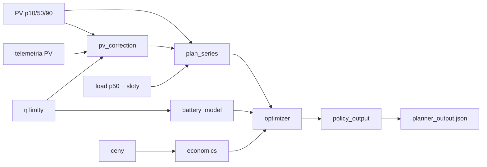

# Architektura planera

**Stan kodu:** [IMPLEMENTED.md](IMPLEMENTED.md) (co jest w repo vs ten dokument docelowy).

Planer **co 10 min**: ceny (h z RCE+import do ostatniej znanej) → PV `k_intra` (h, h+1) → `pv_plan` / `load_plan` → **max Σ cashflow** (`e_bat`) → **policy** → `state/planner_output.json`. Guardian **co 1 min** (po integracji: czyta policy).

**Kolejność:** (1) lista godzin z cenami → (2) PV+telemetria → (3) `pv_correction` → (4) `plan_series` → (5) `optimizer` + `battery_model` + `economics` → (6) `policy_output` → (7) `planner_service` zapis.

| Moduł | Plik |
|--------|------|
| Orkiestracja | [planner_service.md](modules/planner_service.md) |
| Korekta PV | [pv_correction.md](modules/pv_correction.md) |
| Serie planu | [scenarios.md](modules/scenarios.md) |
| Load | [load_forecast.md](modules/load_forecast.md) |
| Bateria | [battery_model.md](modules/battery_model.md) |
| PLN/h | [economics.md](modules/economics.md) |
| Solver | [optimizer.md](modules/optimizer.md) |
| JSON | [policy_output.md](modules/policy_output.md) |

**Typy:** `HorizonStep`, `PriceHour`, `PvHourForecast`, `PvCorrectionResult`, `PlanSeries`, `PlannerDecision`, `PlannerPolicyArtifact` — pola jak w kodzie; **norma:** [PLANNING_SYSTEM.md](../../PLANNING_SYSTEM.md) §12.

**Testy:** czyste funkcje (`pv_correction`, `economics`, `battery_model`); optimizer na małym H; snapshot JSON.

| Problem | Działanie |
|---------|-----------|
| Brak pary cen dla h | Poza horyzontem |
| Słaba telemetria | `k_intra` nieaktywne → surowy Solcast |
| Brak pliku dla Guardian | Tak jak dziś (bez policy) |
