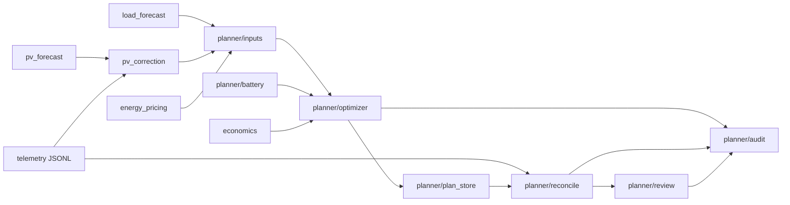

# Stan implementacji planera

Opis **tego, co jest w kodzie** (commit z pakietem `planner/`).  
Norma docelowa produktu: [PLANNING_SYSTEM.md](../../PLANNING_SYSTEM.md) §12 oraz moduły w [modules/](modules/).

---

## Szybki podgląd

| Obszar | Status |
|--------|--------|
| Cel PLN (cashflow / h) | **Zaimplementowane** — `economics.py` |
| Optymalizacja horyzontu | **Zaimplementowane** — DP po `target_net_kwh` |
| Prognoza load (p50) | **Zaimplementowane** — istniejący `load_forecast.py` |
| Prognoza PV (Solcast) | **Zaimplementowane** — istniejący `pv_forecast.py` |
| Ceny RCE + G12 | **Zaimplementowane** — `energy_pricing.py` |
| Audyt (JSONL) | **Zaimplementowane** — nie było w docs docelowych |
| Day audit (KPI) | **Zaimplementowane** — `day_audit.py`, snapshot + dashboard |
| Review / reconcile | **Zaimplementowane** — CLI + `DayReview` |
| Korekta PV (`k_intra`, h + h+1) | **Zaimplementowane** — `planner/pv_correction.py` |
| `plan_series`, sloty load | **Brak** |
| `policy_output` → Guardian | **Brak** |
| Cykl co 10 min | **Brak** |
| `state/planner_output.json` | **Brak** — inna ścieżka artefaktów |

---

## Mapowanie: dokument docelowy → kod

| Moduł (docs) | Plik docelowy | Implementacja |
|--------------|---------------|----------------|
| economics | [economics.md](modules/economics.md) | `economics.py` + użycie w `planner/optimizer.py`, `review.py` |
| load_forecast | [load_forecast.md](modules/load_forecast.md) | `load_forecast.py` → `planner/inputs.py` (`load_kwh_p50`) |
| battery_model | [battery_model.md](modules/battery_model.md) | `planner/battery.py` (uproszczone — patrz różnice poniżej) |
| optimizer | [optimizer.md](modules/optimizer.md) | `planner/optimizer.py` (DP, nie coordinate descent) |
| pv_correction | [pv_correction.md](modules/pv_correction.md) | `planner/pv_correction.py` → `planner/inputs.py` |
| plan_series / scenarios | [scenarios.md](modules/scenarios.md) | — |
| policy_output | [policy_output.md](modules/policy_output.md) | — |
| planner_service | [planner_service.md](modules/planner_service.md) | `planner/service.py` + `planner/__main__.py` |
| Architektura | [ARCHITECTURE.md](ARCHITECTURE.md) | Ten plik + faktyczny przepływ poniżej |

---

## Przepływ (jak działa dziś)



1. **`plan`** — `build_daily_plan()`: od północy doby lokalnej, 24 h (domyślnie), SOC z telemetrii lub `--soc`.
2. Zapis planu:
   - **najnowszy:** `data/planner/plans/plan_YYYY-MM-DD.json` (nadpisywany),
   - **historia:** `data/planner/plans/history/plan_{plan_id}.json` (niezmienny snapshot każdego przebiegu).
3. Audyt: `data/planner/audit/audit_YYYY-MM-DD.jsonl` — zdarzenie `plan_created` (z `plan_id`).
4. Rekonsyliacja/review: dla godziny `h` bierze plan **obowiązujący przed :00** (`plan_effective_at`), nie ostatni z wieczora.
4. **`reconcile`** — porównanie planu z telemetrią per godzina → `hour_reconciled`.
5. **`review`** — suma PLN, perfect foresight, rekomendacje → `data/planner/reviews/review_YYYY-MM-DD.json` + `day_reviewed`.

Guardian (`hourly_balance_run.py`) **nie czyta** planu — sterowanie bez zmian (heurystyki watchdog).

---

## Pliki pakietu `planner/`

| Plik | Odpowiedzialność |
|------|------------------|
| `config.py` | Ścieżki `data/planner/*`, env (`PLANNER_*`) |
| `models.py` | `HourInputs`, `HourPlan`, `DailyPlan`, `AuditEvent`, `DayReview`, … |
| `inputs.py` | Składanie prognoz + cen na horyzoncie |
| `pv_correction.py` | `k_intra` z telemetrii vs Solcast p50 (h, h+1) |
| `battery.py` | SOC, η, limity mocy; `battery_delta = pv − load − net` |
| `optimizer.py` | DP: maks. Σ cashflow, akcja = `target_net_kwh` (siatka 0,25 kWh) |
| `plan_store.py` | Odczyt/zapis `plan_*.json` |
| `day_audit.py` | Dzienny audyt: fakty vs perfect foresight; snapshot JSON |
| `telemetry.py` | Agregaty godzinowe z `data/telemetry/*.jsonl` |
| `reconcile.py` | Plan vs fakty + counterfactual na 1 h |
| `review.py` | Retrospektywa doby + lista rekomendacji |
| `service.py` | `build_daily_plan`, `reconcile_day`, `review_day` |
| `__main__.py` | CLI |

Testy: `tests/test_planner.py`, `tests/test_economics.py`.

---

## CLI

```bash
uv run python -m planner plan [--soc PCT]
uv run python -m planner audit [--date YYYY-MM-DD]
```

**Harmonogram (cron zewnętrzny):**

```bash
# rolling plan co ~10 min
*/10 * * * * cd /path/to/goodweguardian && uv run python -m planner plan

# dzienny audyt wczorajszej doby (00:30)
30 0 * * * /path/to/goodweguardian/scripts/daily_audit.sh
```

Snapshot audytu: `data/planner/audits/audit_YYYY-MM-DD.json`.  
Dashboard KPI: `GET /api/kpi/day?day=YYYY-MM-DD` (saved-first dla przeszłości; dziś — recompute).

Katalogi wynikowe (w `.gitignore` przez `data/`): `data/planner/plans/`, `audit/`, `audits/`, `reviews/`.

---

## Zgodność z §12 (PLANNING_SYSTEM.md)

| Punkt §12 | W kodzie |
|-----------|----------|
| **2** Cel cashflow PLN | Tak — `cashflow_pln_for_hour` |
| **3** `pv_plan`, `load_plan`, max Σ | Częściowo — load z nowcast; PV z `k_intra` (h, h+1); brak `plan_series` |
| **4** policy + parametry dla Guardiana | Nie |
| **5** bateria, η | Tak — `planner/battery.py`; bez cap `P_INVERTER` |
| **6** korekta PV (`k_intra`) | Tak — h + h+1; dalsze h = Solcast |
| **8** horyzont tylko z parą cen | Częściowo — zawsze 24 h z `pricing_day_breakdown`; brak obcięcia przy brakach RCE |
| **1** planer co 10 min | Nie — wywołanie ręczne / harmonogram zewnętrzny |

---

## Różnice istotne (docs vs kod)

- **Zmienna sterowania:** docs — `e_bat_kwh[h]`; kod — `target_net_kwh` (bilans licznika), pochodna `battery_delta_kwh`.
- **Solver:** docs — coordinate descent; kod — **programowanie dynamiczne** (SOC dyskretny × siatka net).
- **Korekta load:** docs — jeden `factor`; kod — nowcast z `load_forecast` (waga malejąca w czasie, env `LOAD_NOWCAST_*`).
- **Wyjście:** docs — `state/planner_output.json` + enum policy; kod — plan JSON + audyt, bez mapowania na eco-slot.
- **Horyzont:** docs — rolling od `now`; kod — **cała doba od 00:00** przy `plan` (parametr `start_dt` w `build_hour_inputs`).

---

## Zmienne środowiskowe (planer)

| Zmienna | Domyślnie | Znaczenie |
|---------|-----------|-----------|
| `PLANNER_BATTERY_KWH` | 10 | Pojemność magazynu [kWh] |
| `PLANNER_BATTERY_ETA` | 0.92 | Sprawność round-trip |
| `PLANNER_SOC_MIN_PCT` / `MAX` | 10 / 100 | Granice SOC |
| `PLANNER_HORIZON_HOURS` | 24 | Długość horyzontu (legacy API) |
| `PLANNER_LOAD_LOOKBACK_DAYS` | 28 | Lookback load forecast |
| `PV_CORRECTION_ENABLED` | true | Włącz korektę `k_intra` |
| `PV_CORRECTION_EPS_KWH` | 0.1 | Próg ε [kWh/h] |
| `PV_CORRECTION_K_MIN` / `K_MAX` | 0.65 / 1.35 | Clip `k_intra` |

Współdzielone z Guardianem: `P_BATTERY`, proxy RCE/Solcast, taryfa G12, `data/telemetry/`.

---

## Kolejne kroki (docelowo, poza tym plikiem)

1. `policy_output` + odczyt w `hourly_balance_run.py`
3. Harmonogram 10 min
4. Horyzont cen zgodny z §12 pkt 8 (obcięcie przy brakach)

*Przy zmianach w `planner/` — aktualizuj ten plik.*
